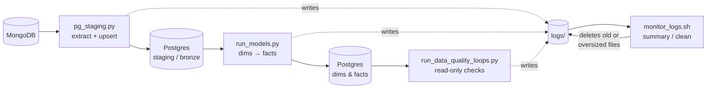

# Architecture

This project is a small ELT pipeline: data is pulled from MongoDB into
Postgres, transformed into a dimensional model, checked for data quality,
and the logs that all of this produces are kept tidy. Four scripts cover
these steps — see `scripts.md` for usage details on each.

## Pipeline overview



## Stages

1. **Staging (`pg_staging.py`)** — Copies each MongoDB collection into a
   same-named Postgres table in the bronze/staging schema. The first run
   per collection does a full load; later runs pull only documents newer
   than the stored `update_at` watermark and upsert by `_id`. Collections
   without `update_at` fall back to a full refresh every run.

2. **Modeling (`run_models.py`)** — Runs a fixed, ordered sequence of
   `.sql` files in `models/` against Postgres: dimension tables first,
   then the facts that reference them. Each file is DDL + upsert logic
   in one script, run in its own transaction.

3. **Data quality (`run_data_quality_loops.py`)** — Executes the
   read-only SQL "loops" in `tests/*_lp_*.sql`, which raise a `NOTICE`
   per failed check plus a rollup line. The script parses those notices
   into a pass/fail summary — it never modifies data.

4. **Log housekeeping (`monitor_logs.sh`)** — All three Python scripts
   log through `utils.logger` into `logs/`. This shell script reports on
   (or deletes) log files that are too old or too large, always keeping
   the most recently modified file regardless of age or size.

## Shared conventions

- Every Python script auto-detects the project root by walking up to the
  `pyproject.toml`, so they can be run from anywhere (e.g. via
  `uv run scripts/<name>.py`).
- All Postgres access goes through `utils.connection.get_postgres_engine()`
  and one raw connection/cursor per unit of work (per collection, per
  model file), so one failure doesn't abort the whole run.
- All three Python scripts pair a human-facing **Rich** console summary
  with full detail sent to `utils.logger`.

## Directory layout (as referenced by the scripts)

```
project/
├── logs/                  # written by utils.logger, read by monitor_logs.sh
│   ├── staging/
│   ├── core/
│   └── tests/
├── models/                # *.sql files run in sequence by run_models.py
├── tests/                 # *_lp_*.sql data-quality loops
├── scripts/
│   ├── monitor_logs.sh
│   ├── pg_staging.py
│   ├── run_data_quality_loops.py
│   └── run_models.py
├── utils/                 # connection.py, engine.py, logger.py
└── pyproject.toml
```

## Notes / things to double check

- `pg_staging.py` targets `POSTGRES_SCHEMA_BRONZE` as a stand-in for a
  literal "staging" schema (see the `NOTE ON SCHEMA` comment in the file);
  set `POSTGRES_SCHEMA_STAGING` in `.env` if you want a real separate schema.
- The dim → fact order in `run_models.py` is maintained by hand
  (`MODEL_SEQUENCE`), not auto-discovered — new models need to be added
  in the right position.