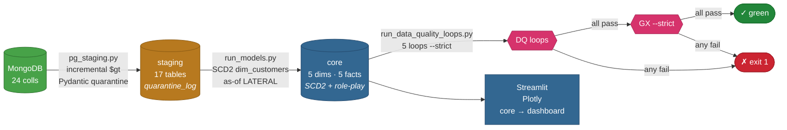

<p align="center">
  
</p>

<h1 align="center">Data Modelling Warehouse</h1>

<p align="center">
  <b>MongoDB → PostgreSQL → Dagster → Streamlit</b><br>
  <!-- An analytics-engineering warehouse — not a notebook demo. -->
</p>

<p align="center">
  <a href="https://www.python.org/"></a>
  <a href="https://www.postgresql.org/"></a>
  <a href="https://www.mongodb.com/"></a>
  <a href="https://dagster.io/"></a>
  <a href="https://www.docker.com/"></a>
  <a href="https://streamlit.io/"></a>
  <a href="https://github.com/features/actions"></a>
  <a href="https://github.com/Nitinx12/Data-Modelling/blob/main/LICENSE"></a>
</p>

<p align="center">
  <a href="https://data-modelling-uclgdbxwbuwhw9dtk4q9t8.streamlit.app"></a>
  <a href="https://github.com/Nitinx12/Data-Modelling"></a>
</p>

> **Kimball warehouse** — 5 dims (`dim_customers` SCD2, `dim_geo` ×2, `dim_orders_flag` junk) · 5 facts · incremental Mongo → Postgres (`staging.quarantine_log`) · double-gated quality (SQL loops + GX) · one pipeline, three runners (Makefile/Dagster/Docker).

## Live Dashboard — `core` warehouse

<p align="center">
  <a href="https://data-modelling-uclgdbxwbuwhw9dtk4q9t8.streamlit.app"></a><br>
  <em>Seeded demo DB — not the live pipeline. See <code>dashboard/README.md</code> + <code>docs/HOSTING.md</code>.</em>
</p>

| Page | Fact | Shows |
|------|------|-------|
| **Overview** | all | KPI cards: order lines, paid rate, spend, SCD2 versions |
| **Fulfillment** | `fact_order_process` | Funnel Ordered→Paid (accumulating snapshot, COALESCE-guarded) |
| **Sales** | `fact_orders` | Revenue trend, top products, ship-to vs bill-to (`dim_geo` ×2) |
| **Marketing** | `fact_campaign_spend` + `fact_less_fact` | Spend / promoted-SKU (via `dim_campaign`/`dim_products`) |
| **Inventory** | `fact_inventory` | Monthly stock (2025 unpivoted) by category |
| **Health** | `pipeline_run_log` | Run durations, SCD2 history, orphans, quarantines |

---

## Architecture at a glance



> Every arrow into `core` and beyond is a quality gate — the next layer only builds if the prior passes. Full breakdown: `docs/ARCHITECTURE.md`.

---

## One pipeline, three runners

| Runner | Command | Notes |
|--------|---------|-------|
| **Local** | `make pipeline` | `staging` → `models` → `quality` → `GX` via `scripts/python/main.py` (run_id + `pipeline_run_log`) |
| **Dagster** | `make dagster-dev` | Asset DAG `staging_all` → `dim_*` → `fact_*` → `quality` (`0 6 * * *`, `:3000`) — `orchestration/definitions.py:12` |
| **Docker** | `docker compose up --build` | `postgres:16-alpine` + `mongo:7` + `pipeline` (seeded via `docker/postgres-init`/`mongo-seed`, healthchecked) |

`make pipeline-continue` continues past model failures; `--strict` makes red data fail the pipeline (CI).

---

## Highlights

| Area | What's there |
|------|--------------|
| **Incremental** | `$gt` watermark pushdown from Mongo, `ON CONFLICT` upserts, Pydantic pre-validation → `staging.quarantine_log` (never silent) |
| **Modeling** | Kimball bus: 5 dims (`dim_customers` SCD2 `valid_from/to/is_current`, `dim_geo` role-playing ×2, `dim_orders_flag` junk), 5 facts (transaction/accumulating/factless/periodic), `fact_orders` `LATERAL` as-of + `MIN`+`DISTINCT ON` for `Kitchen M006` collisions |
| **Quality** | 5 SQL loops (catalog-driven, `information_schema`) + 5 GX suites (33 expectations) — `DECISIONS.md:22` double-gated |
| **Observability** | `core.pipeline_run_log` (`run_id`, `stage`, `duration_ms`, `row_count`) written by `run_models.py:218`/`quality`/`gx`, surfaced in dashboard Health |
| **CI** | `lint` + `format-check` + `47 tests` + live `postgres:16`+`mongo:7` `make pipeline` + Dagster load on every PR — `.github/workflows/ci.yml` |

---

## Tech Stack

| Layer | Technology | Notes |
|-------|------------|-------|
| Language | Python 3.13 | `uv` + `uv.lock` is source of truth |
| Compute | PySpark 4.2 | `openjdk-17` for `pyspark` |
| Warehouse | PostgreSQL 16 | `staging` → `core` → `analytics` |
| Source | MongoDB 7 | 24 collections, incremental `$gt` |
| Orchestration | Dagster 1.13 | Software-defined assets, `Definitions` |
| Quality | Great Expectations 1.x | 5 suites, `TQDM_DISABLE=1` |
| BI | Streamlit 1.64 + Plotly 7.0 | `dashboard/` on `core` |
| Lint | Ruff + pre-commit | `ruff check` / `ruff format` |
| Containers | Docker / Compose | `docker/Dockerfile` + `docker-compose.yml` (`5433:5432`/`27018:27017` on host) |

---

## Run it

```bash
# One-command Docker demo (no local DB needed)
docker compose up --build          # postgres:16 + mongo:7 + pipeline (seeded)
docker compose exec postgres psql -U user -d data_warehouse -c "SELECT count(*) FROM core.fact_orders;"
docker compose run --rm pipeline uv run ruff check .  # any make target inside

# Local (needs .env + Postgres/Mongo)
make setup-dev          # uv sync + .env scaffold + health_check
make pipeline           # local: staging → models → quality → GX

# Dagster UI
make dagster-dev        # http://localhost:3000  (asset graph)

# Dashboard (reads core)
make dashboard          # http://localhost:8501 (needs [postgres] secrets or POSTGRES_* env)
```

Windows, without make/WSL:

```bat
Batchfile.bat help          # every target, mirrored from the Makefile
Batchfile.bat pipeline      # staging → models → quality → GX
Batchfile.bat lint          # also: format-check, test, quality, gx, health-check
```

`make help` lists all 30+ targets (`compose-*`, `dashboard`, `health-check --deep`, `logs-summary`, `distclean`).

---

## Repo structure

```
Data-Modelling/
├── docker/              # Dockerfile (uv + dev), postgres-init, mongo-seed
├── dashboard/           # Streamlit (Home + 5 pages, lib/db+charts, .streamlit/)
├── orchestration/       # Dagster assets (staging → core → quality) + definitions.py
├── models/              # Hand-built PL/pgSQL (10) — dims/facts, SCD2, as-of LATERAL
├── scripts/python/      # pg_staging (Pydantic) + run_models (SCD2+log) + quality + gx + main
├── sql/                 # 00 bootstrap, 11_pipeline_run_log.sql, analytics/
├── tests/sql/data_quality/ # 5 loops (required_text, future_date, negative, duplicate, orphan)
├── gx/                  # 5 suites (duplicate_key, future_date, negative, orphan_fk, required_text)
├── utils/               # engine, connection, logger, validation (Pydantic)
├── Batchfile.bat        # Windows entry point mirroring the Makefile (no make/WSL)
└── Makefile             # production-grade (compose/dashboard/dagster)
```

---

## Documentation

| Doc | Covers |
|-----|--------|
| `ARCHITECTURE.md` | System design, execution paths |
| `docs/data_catlog.md` | Grain, keys, SCD2, role-playing `dim_geo` |
| `docs/ERD.md` | ERD + bus matrix |
| `orchestration/README.md` | Dagster asset DAG |
| `dashboard/README.md` | Dashboard schema + deploy |
| `docs/HOSTING.md` | Neon/Supabase + Streamlit Cloud + `refresh.yml` |
| `docs/DECISIONS.md` | `D1–D12` + `O1–O4` |
| `docs/ADR-001-name-joins-vs-stable-ids.md` | Name-joins ADR (keep with guards until source emits IDs) |
| `docs/TESTS.md` | SQL loops reference |
| `docs/GIT_WORKFLOW.md` | Branching, commits, hooks |

---

<p align="center">
  <a href="https://github.com/Nitinx12/Data-Modelling"></a>
  <a href="https://github.com/Nitinx12/Data-Modelling/issues"></a>
  <a href="https://github.com/sponsors/Nitinx12"></a>
</p>

<p align="center"><em>Built with ❤️ for the data community · MIT License</em></p>
