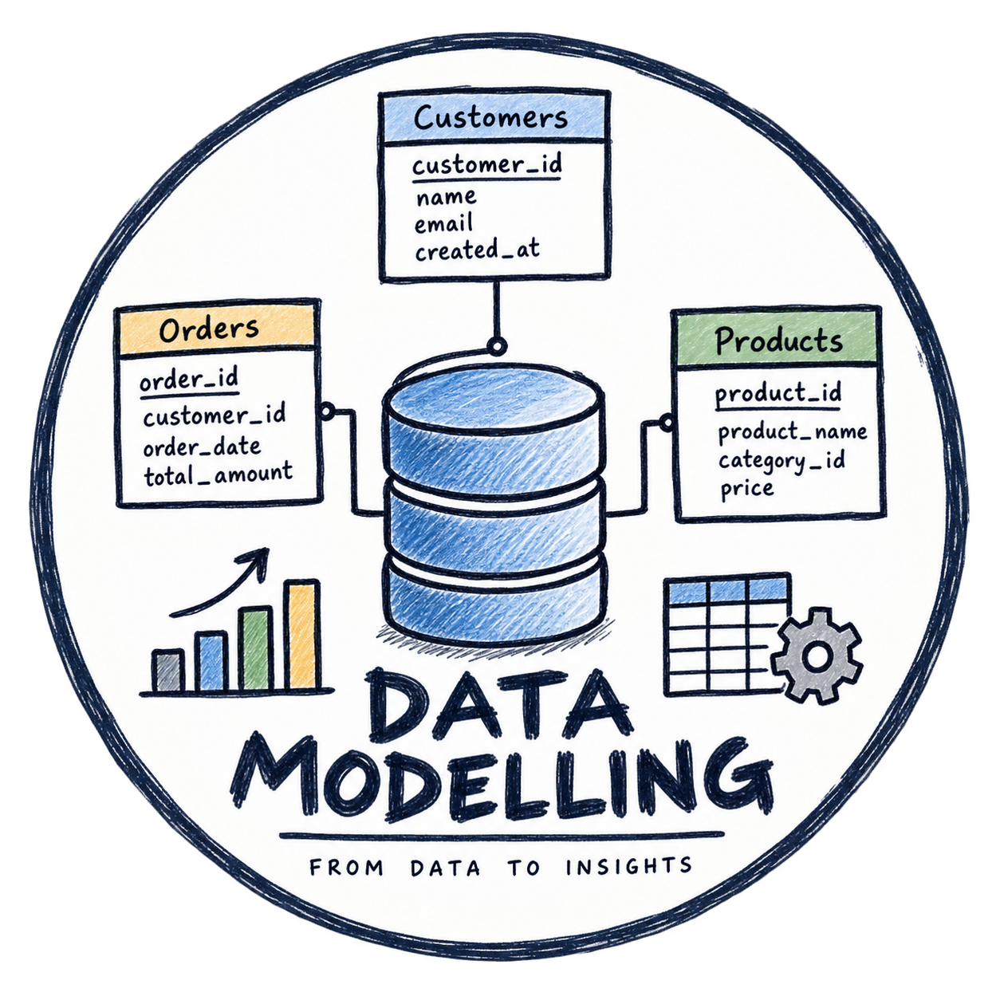
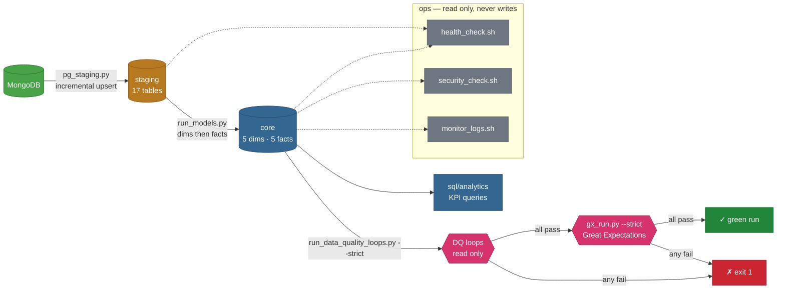

<p align="center">
  
</p>

<h1 align="center">Warehouse Pipeline</h1>

<p align="center">
  MongoDB → Postgres staging → dimensional models → data quality checks,
  orchestrated with a thin Makefile.
</p>

---

## Overview

A Kimball-style analytics warehouse where MongoDB documents flow into PostgreSQL staging and are transformed into a core fact constellation with five conformed dimensions and five fact tables. A catalog-driven, read-only PL/pgSQL test suite audits both schemas after each load, failing the pipeline on any red check.

---
## Tech stack

<p align="center">
  <a href="https://www.mongodb.com/"></a>
  <a href="https://www.postgresql.org/"></a>
  <a href="https://www.python.org/"></a>
  <a href="https://pandas.pydata.org/"></a>
  <a href="https://www.sqlalchemy.org/"></a>
</p>

<p align="center">
  <a href="https://docs.astral.sh/uv/"></a>
  <a href="https://pymongo.readthedocs.io/"></a>
  <a href="https://github.com/Textualize/rich"></a>
  <a href="https://docs.astral.sh/ruff/"></a>
  <a href="https://docs.pytest.org/"></a>
  <a href="https://github.com/features/actions"></a>
  <a href="https://www.gnu.org/software/bash/"></a>
  <a href="https://learn.microsoft.com/powershell/"></a>
</p>

## How it flows



`make pipeline` runs the staging → models → quality → GX chain in one command.
The ops scripts verify and maintain the result without ever writing to it.

```Bash
make setup-dev          # uv sync + .env scaffold + health check (one time)
make config             # confirm resolved variables
make pipeline           # staging load -> models -> data quality -> GX
make install            # install/sync all project dependencies via uv
make check-env          # Verify a .env file exists before running anything DB-related
make lint               # Run ruff checks over the codebase (no changes made)
make lint-fix           # Run ruff checks and auto-fix what it safely can
make format-check       # Check formatting with ruff without changing files
make staging            # Load every Mongo collection into staging
make models             # Run every model in sequence, in dependency order
make quality            # Run the read only data quality SQL loops
make gx                 # Run the Great Expectations suites (all, or one by name)
make analytics          # SQL analytics queries
make health-check       # Verify tools, env, DBs, logs, and venv.
make clean              # Remove Python cache artifacts (safe — no data or log deletion)
```
**Note** Explore the available make commands yourself. Run `make help` or inspect the Makefile to discover additional commands and understand what each one does.

## Repo structure

```
Data-Modelling/
├── models/                  # dimension + fact load SQL (run by run_models.py)
├── scripts/
│   ├── python/              # pipeline: pg_staging, run_models, quality, gx, main
│   ├── bash/                # ops: health, security, logs, setup, pipeline
│   └── powershell/          # Windows equivalents, kept in lockstep
├── sql/
│   ├── 00_create_database_and_schemas.sql   # bootstrap (manual, not CI)
│   ├── 09_fn_customer_function.sql          # helper functions
│   ├── 10_fn_products_function.sql
│   └── analytics/           # ad hoc KPI queries (read only, via make analytics)
├── tests/
│   ├── python/unit/         # pytest unit tests for utils/
│   └── sql/data_quality/    # the five read only DQ loops
├── gx/                      # Great Expectations suites (run by gx_run.py)
├── docs/                    # reference docs (catalog, ERD, runbook, decisions)
├── utils/                   # shared Python: engine, connection, logger
├── assets/                  # logo and diagrams
└── Makefile                 # thin wrappers, no logic
```

## Requirements

- [`uv`](https://github.com/astral-sh/uv)
- `bash`
- `psql` (for `make analytics` and `make health-check`)
- `mongosh` (for `make health-check`)
- A `.env` file at the project root (copy `.env.example` and fill it in)

> **Windows:** run everything from inside WSL — the Makefile shells out
> to `bash`, and all `scripts/*.sh` need a real POSIX shell, not
> PowerShell/cmd.exe. The `.ps1` equivalents work natively.

## Docs

| Doc | What's in it |
|---|---|
| [`ARCHITECTURE.md`](ARCHITECTURE.md) | The pipeline end to end, with a diagram, stage by stage explanation, shared conventions, and directory layout. |
| [`scripts.md`](docs/scripts.md) | Per-script reference — usage, flags, where each one logs to. |
| [`data_catlog.md`](docs/data_catlog.md) | Data Catlog of dim and fact tables. |
| [`ERD.md`](docs/ERD.md) | A visual flowchart that maps out how data objects, or entities, relate to each other within a database system. |
| [`TESTS.md`](docs/TESTS.md) | SQL data-quality loop reference (runs from `tests/sql/data_quality/`). |
| [`OPERATIONS.md`](docs/OPERATIONS.md) | Runbook — running the pipeline, daily checks, logs, what to do when a run fails, cron. |
| [`TROUBLESHOOTING.md`](docs/TROUBLESHOOTING.md) | Symptom → cause → fix for setup, pipeline, and CI problems. |
| [`DECISIONS.md`](docs/DECISIONS.md) | Decision log — settled design decisions and open items awaiting a data owner. |
| [`GIT_WORKFLOW.md`](docs/GIT_WORKFLOW.md) | Git workflow guide — branching, Conventional Commits, production repo files, hooks, releases. |

