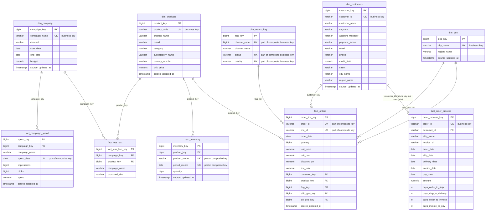

# Entity-Relationship Diagram — `core` Schema

A fact constellation (galaxy schema): five conformed dimensions shared across five fact tables of different types (transaction, periodic snapshot, accumulating snapshot, factless).



---

## Reading the Diagram

- **`||--o{`** = one dimension row relates to zero-or-many fact rows (standard star-schema cardinality). No fact table in this model has a mandatory-one-to-mandatory-one relationship back to a dimension — every FK is nullable, since a join can fail to resolve.
- **Role-playing dimension:** `dim_geo` appears **twice** against `fact_orders` (`ship_geo_key`, `bill_geo_key`) — the same physical table used in two different business roles on one fact row.
- **Fact constellation, not a single star:** `fact_campaign_spend` and `fact_less_fact` both reference `dim_campaign`/`dim_products` but are **never joined to each other**. They're connected only by conforming to the same dimensions — the defining feature of a galaxy schema over a single star schema.
- **Odd one out:** `fact_order_process.customer_id` is the only fact-to-dimension link in the model built on a **natural/business key** (`dim_customers.customer_id`) rather than the surrogate key (`dim_customers.customer_key`) that every other fact table uses. Functionally fine (it's still unique + indexed), but inconsistent with the rest of the model's key strategy.
- **Degenerate dimensions:** `order_id` (on `fact_orders` and `fact_order_process`) and `invoice_id` (on `fact_order_process`) are degenerate — carried directly on the fact with no dimension table of their own.

## Fact Table Types in This Model

| Fact table | Type | Why |
|---|---|---|
| `fact_campaign_spend` | Transaction fact | New measurable event per campaign per day |
| `fact_orders` | Transaction fact | New measurable event per order line |
| `fact_inventory` | Periodic snapshot | Quantity measured at a fixed monthly interval, regardless of activity |
| `fact_order_process` | Accumulating snapshot | Single row per order, overwritten in place as it moves through order → ship → deliver → invoice → pay |
| `fact_less_fact` | Factless fact | Records that a relationship occurred (SKU promoted in campaign); carries no numeric measures |

## Load Order (topological)

```
1. dim_campaign
2. dim_customers
3. dim_geo
4. dim_orders_flag
5. dim_products
   ── all dimensions must complete before any fact below ──
6. fact_campaign_spend   (needs dim_campaign)
7. fact_inventory        (needs dim_products)
8. fact_less_fact        (needs dim_campaign, dim_products)
9. fact_order_process    (needs dim_customers)
10. fact_orders          (needs dim_customers, dim_products, dim_orders_flag, dim_geo)
```

*See `data_catalog.md` for full column-level definitions, business keys, and known data-quality caveats.*