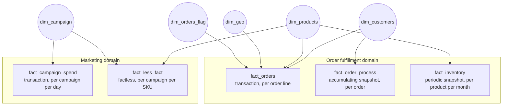
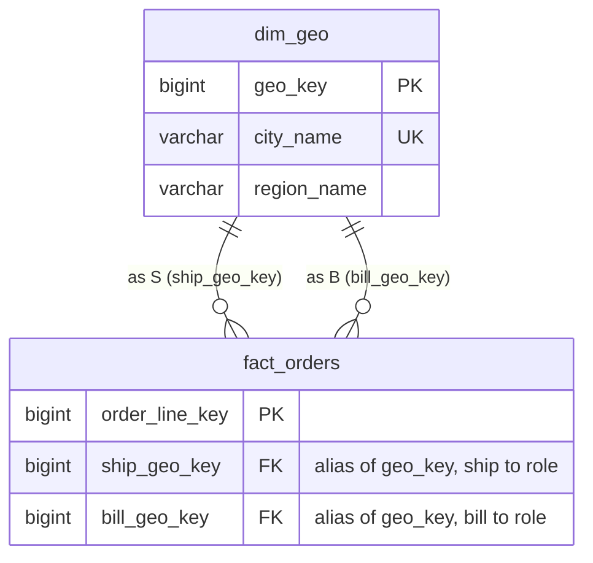
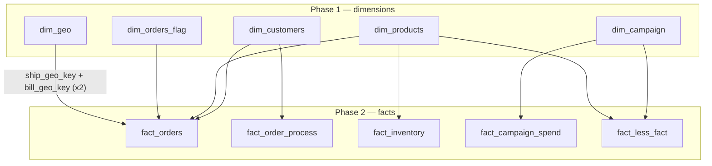

# ERD — Entity Relationship Diagram

This is the visual reference for the `core` schema: the full column level
ERD, the fact constellation view, the role playing dimension detail, and the
topological load order. For prose explanations of each pattern see `Schema.md`;
for per column lineage and caveats see `data_catlog.md`.

---

## 1. Full ERD (column level)

Every `core` table with its complete column set. Surrogate keys are identity
columns; business keys carry the `UK` marker. Audit columns (`dw_created_at`,
`dw_updated_at`) exist on every mutable table and are omitted here only where
noted — they are listed in full in `data_catlog.md`.

```mermaid
erDiagram
    dim_customers {
        bigint customer_key PK "surrogate key"
        varchar customer_id UK "business key"
        varchar customer_name
        varchar segment
        varchar account_manager
        varchar payment_terms
        varchar email "primary contact only"
        varchar phone
        numeric credit_limit
        varchar street
        varchar city_name "denormalized from cities"
        varchar region_name "denormalized from cities"
        timestamp source_updated_at "drives SCD1 change detection"
    }
    dim_products {
        bigint product_key PK "surrogate key"
        varchar product_code UK "business key"
        varchar product_name
        varchar brand
        varchar category "INITCAP normalized"
        varchar subcategory_name
        varchar primary_supplier
        numeric unit_price "NULL if source price invalid"
        timestamp source_updated_at
    }
    dim_geo {
        bigint geo_key PK "surrogate key"
        varchar city_name UK "business key"
        varchar region_name "attribute, not a FK"
        timestamp source_updated_at
    }
    dim_campaign {
        bigint campaign_key PK "surrogate key"
        varchar campaign_name UK "business key"
        varchar channel
        date start_date
        date end_date
        numeric budget
        timestamp source_updated_at
    }
    dim_orders_flag {
        bigint flag_key PK "surrogate key"
        bigint channel_code "part of composite business key"
        varchar channel_name "resolved via staging.channels"
        varchar status "part of composite business key"
        varchar priority "part of composite business key"
    }
    fact_orders {
        bigint order_line_key PK
        varchar order_id "degenerate dimension"
        varchar line_id "part of composite key"
        bigint customer_key FK
        bigint product_key FK
        bigint flag_key FK
        bigint ship_geo_key FK "role: ship to"
        bigint bill_geo_key FK "role: bill to"
        bigint quantity
        numeric unit_price
        numeric unit_cost
        numeric discount_pct
        numeric line_total
        timestamp source_updated_at "latest of line item or header"
    }
    fact_order_process {
        bigint order_process_key PK
        varchar order_id UK "business key, degenerate"
        bigint customer_key FK
        varchar ship_mode
        varchar invoice_id "degenerate dimension"
        date order_date
        date ship_date "milestone"
        date delivery_date "milestone"
        date invoice_date "milestone"
        date pay_date "milestone"
        numeric amount "from invoice"
        int days_order_to_ship "derived lag"
        int days_ship_to_delivery "derived lag"
        int days_order_to_invoice "derived lag"
        int days_invoice_to_pay "derived lag"
    }
    fact_inventory {
        bigint inventory_key PK
        bigint product_key FK
        varchar product_name "part of composite key"
        date period_month "first of month, part of composite key"
        bigint quantity
        timestamp source_updated_at
    }
    fact_campaign_spend {
        bigint spend_key PK
        bigint campaign_key FK
        varchar campaign_name "part of composite key"
        date spend_date "part of composite key"
        bigint impressions
        bigint clicks
        numeric spend
        timestamp source_updated_at
    }
    fact_less_fact {
        bigint fact_less_fact_key PK
        bigint campaign_key FK "nullable"
        bigint product_key FK "nullable"
        varchar campaign_name "degenerate copy"
        varchar promoted_sku "degenerate copy"
    }

    dim_customers   ||--o{ fact_orders         : "customer_key"
    dim_products    ||--o{ fact_orders         : "product_key"
    dim_orders_flag ||--o{ fact_orders         : "flag_key"
    dim_geo         ||--o{ fact_orders         : "ship_geo_key (ship to)"
    dim_geo         ||--o{ fact_orders         : "bill_geo_key (bill to)"
    dim_customers   ||--o{ fact_order_process  : "customer_key"
    dim_products    ||--o{ fact_inventory      : "product_key"
    dim_campaign    ||--o{ fact_campaign_spend : "campaign_key"
    dim_campaign    ||--o{ fact_less_fact      : "campaign_key"
    dim_products    ||--o{ fact_less_fact      : "product_key"
```



---

## 2. Fact Constellation View

The same model arranged as a galaxy: conformed dimensions in the middle, fact
tables around them, grouped by business domain. Edges are dimension to fact
references; facts never reference each other.



The bridge between the two domains is `dim_products`: it is referenced by
`fact_orders` and `fact_inventory` on the fulfillment side and by
`fact_less_fact` on the marketing side. Any question that spans both domains
("did promoted products sell better during their campaign?") routes through
that shared dimension rather than a direct fact to fact join.

---

## 3. Role Playing Dimension — `dim_geo`

`dim_geo` is referenced twice by `fact_orders`, once per business role. The
two foreign keys are aliases of the same surrogate key; analysts qualify the
join with a table alias per role.



A typical analytical query joins the dimension twice:

```sql
SELECT s.region_name  AS ship_region,
       b.region_name  AS bill_region,
       SUM(f.line_total)
FROM   core.fact_orders f
JOIN   core.dim_geo s ON s.geo_key = f.ship_geo_key
JOIN   core.dim_geo b ON b.geo_key = f.bill_geo_key
GROUP  BY 1, 2;
```

---

## 4. Reading the Diagram

- **`||--o{`** = one dimension row relates to zero or many fact rows (standard star schema cardinality). No fact table in this model has a mandatory one to one relationship back to a dimension — every FK is nullable, since a join can fail to resolve.
- **Role playing dimension:** `dim_geo` appears **twice** against `fact_orders` (`ship_geo_key`, `bill_geo_key`) — the same physical table used in two different business roles on one fact row. See §3.
- **Fact constellation, not a single star:** `fact_campaign_spend` and `fact_less_fact` both reference `dim_campaign`/`dim_products` but are **never joined to each other**. They're connected only by conforming to the same dimensions — the defining feature of a galaxy schema over a single star schema.
- **Key strategy:** every fact to dimension link in the model, including `fact_order_process`, uses the surrogate key (`dim_customers.customer_key` and friends). Dimensions are still *resolved* via name joins at load time — the staging sources carry names, not IDs.
- **Degenerate dimensions:** `order_id` (on `fact_orders` and `fact_order_process`) and `invoice_id` (on `fact_order_process`) are degenerate — carried directly on the fact with no dimension table of their own.

## Fact Table Types in This Model

| Fact table | Type | Why |
|---|---|---|
| `fact_campaign_spend` | Transaction fact | New measurable event per campaign per day |
| `fact_orders` | Transaction fact | New measurable event per order line |
| `fact_inventory` | Periodic snapshot | Quantity measured at a fixed monthly interval, regardless of activity |
| `fact_order_process` | Accumulating snapshot | Single row per order, overwritten in place as it moves through order → ship → deliver → invoice → pay |
| `fact_less_fact` | Factless fact | Records that a relationship occurred (SKU promoted in campaign); carries no numeric measures |

---

## 5. Load Order (topological)

Dimensions must be populated before any fact that references them, because
each fact script resolves its dimension keys with a join at load time. Within
each phase the order is free — the only hard edges are the ones drawn below.
`run_models.py` walks exactly this graph.



```
1. dim_campaign
2. dim_customers
3. dim_geo
4. dim_orders_flag
5. dim_products
   ── all dimensions must complete before any fact below ──
6. fact_campaign_spend   (needs dim_campaign)
7. fact_inventory        (needs dim_products)
8. fact_less_fact        (needs dim_campaign, dim_products)
9. fact_order_process    (needs dim_customers)
10. fact_orders          (needs dim_customers, dim_products, dim_orders_flag, dim_geo ×2)
```

*See `data_catlog.md` for full column level definitions, business keys, and known data-quality caveats.*
