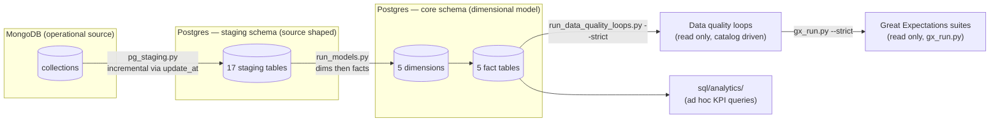
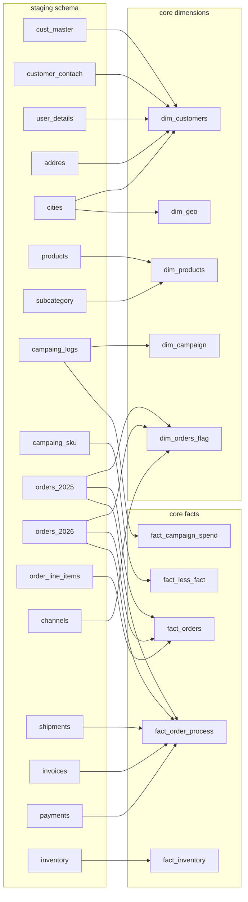
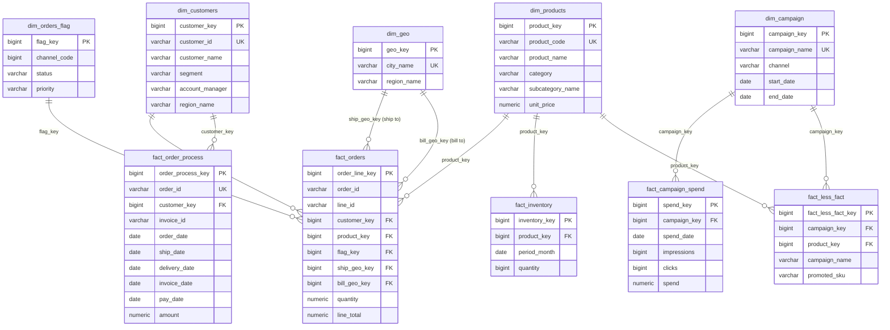
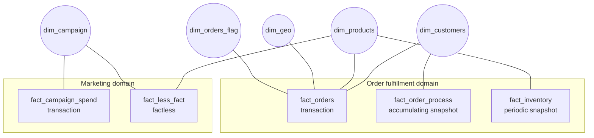
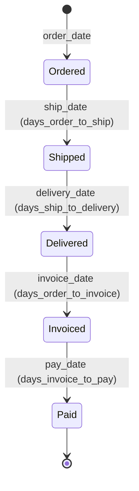
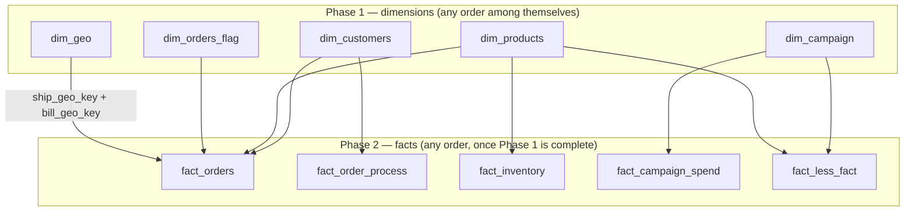

# Data Warehouse Schema Documentation

This document describes the warehouse end to end: the layer architecture, the
source to target map, the entity relationships, the fact constellation, and
the load order. For column level detail (types, business keys, lineage, caveats)
see `data_catlog.md`; for the visual entity relationship reference see `ERD.md`.

---

## 1. Architecture Overview

This warehouse follows a **Kimball style dimensional model**, built in the `core`
schema on top of raw data landed in `staging`. Data flows through three layers:

1. **MongoDB** — the operational source. Collections hold documents that arrive
   in whatever shape the source system produces, including wide pivoted layouts
   (`inventory`) and denormalized event logs (`campaing_logs`).
2. **`staging` (Postgres)** — a faithful, source shaped copy of each collection.
   `pg_staging.py` loads incrementally with an `update_at` watermark and upserts
   by `_id`, so re-runs are safe. No business logic lives here: table and column
   names keep their source typos (`campaing_logs`, `addres`, …) on purpose.
3. **`core` (Postgres)** — the dimensional model. Five conformed dimensions and
   five fact tables, loaded by the scripts in `models/` in dependency order.

Every dimension uses **SCD Type 1** (overwrite in place, no history retained)
driven by a `source_updated_at` comparison, so re-running a load script is always
safe — rows only get touched when something actually changed upstream.

### The two fact families

There are two loosely connected "fact families", tied together by dimensions
that are **conformed** (shared across more than one fact table):

- **Order fulfillment domain** — `fact_orders`, `fact_order_process`, `fact_inventory`
- **Marketing domain** — `fact_campaign_spend`, `fact_less_fact`

`dim_products` is the conformed dimension that bridges the two domains: it's
referenced by `fact_orders`, `fact_inventory`, and `fact_less_fact`.
`dim_campaign` bridges `fact_campaign_spend` and `fact_less_fact`. This is what
makes it a true fact constellation rather than a set of disconnected tables —
you can answer questions that span both domains (e.g. "was this product being
promoted in a campaign when it sold out?") by pivoting through the shared
dimension, without the two facts ever joining to each other directly.

### Fact table patterns used

| Fact | Pattern | Grain |
|---|---|---|
| `fact_orders` | Transaction fact, SCD1 upsert | One row per order line |
| `fact_order_process` | **Accumulating snapshot** | One row per order, revisited/updated as it moves through the pipeline |
| `fact_inventory` | Periodic snapshot, SCD1 upsert | One row per product per month |
| `fact_campaign_spend` | Periodic snapshot, SCD1 upsert | One row per campaign per day |
| `fact_less_fact` | **Factless fact** (relationship only, no measures) | One row per campaign to promoted product pair |

`fact_order_process` is the odd one out: unlike every other fact here, its rows
are *mutated in place* rather than only ever inserted or measure updated — the
same `order_id` row gets its `ship_date`, `delivery_date`, `invoice_date`, and
`pay_date` filled in progressively as the order moves through ordered →
shipped → delivered → invoiced → paid. Milestone columns are COALESCE-guarded
in the upsert so a NULL arriving from the source can never wipe out a
previously-loaded milestone. `order_id` and `invoice_id` are carried as
**degenerate dimensions** — identifiers with no dimension table of their own,
just useful for grouping/filtering directly on the fact.

`dim_orders_flag` is a **junk dimension** — it exists purely to bundle three
low cardinality, unrelated but frequently filtered attributes (`channel`,
`status`, `priority`) into one small table instead of leaving them as bare
columns on `fact_orders`.

---

## 2. Source to Target Map

Every `core` table is built from one or more `staging` tables. The map below is
the complete lineage; the seven staging tables with no outgoing arrow
(`dim_orders`, `exchange_rate`, `invoice_inlines`, `region`, `security`,
`sheet_1`, `target_revenue`) are extracted but consumed by no model yet — see
§7.

Notes on the messier source shapes:

- `campaing_logs` feeds **two** targets: it is deduped to one row per campaign
  for `dim_campaign`, and separately deduped per `(CampaignName, Date)` for the
  daily grain of `fact_campaign_spend`.
- `dim_customers` is the widest table in the model because it denormalizes
  five staging sources in one load — contact, credit, and address attributes
  all land on the same row.
- `staging.inventory` arrives wide (one column per month, `"2025-01"` …
  `"2025-12"`) and is unpivoted via `CROSS JOIN LATERAL` before loading
  `fact_inventory`.

---

## 3. Entity Relationship Diagram

The full column level ERD lives in `ERD.md`; the version below shows the
business relevant columns and every relationship. Note `dim_geo` joins to
`fact_orders` **twice** (ship to and bill to), which is a classic **role
playing dimension** — the same physical table used in two different business
roles on the same fact row.

---

## 4. Fact Constellation (Bus Matrix)

The warehouse is a **galaxy schema**: multiple fact tables sharing conformed
dimensions. The Kimball bus matrix below shows exactly which dimension each
fact references — this is the contract that makes cross domain analysis
possible without joining facts to each other.

| Dimension | `fact_orders` | `fact_order_process` | `fact_inventory` | `fact_campaign_spend` | `fact_less_fact` |
|---|:---:|:---:|:---:|:---:|:---:|
| `dim_customers` | X | X | | | |
| `dim_products` | X | | X | | X |
| `dim_orders_flag` | X | | | | |
| `dim_geo` (ship to) | X | | | | |
| `dim_geo` (bill to) | X | | | | |
| `dim_campaign` | | | | X | X |

The two domains never touch directly. A question like "did promoted products
sell better during their campaign?" is answered by joining `fact_less_fact` →
`dim_products` → `fact_orders`: the shared dimension is the bridge, which is
the defining feature of the constellation pattern.

---

## 5. Fact Tables

### `fact_orders`
- **Grain:** one row per order line (`order_id`, `line_id`)
- **Source:** `staging.orders_2025` + `staging.orders_2026` (unioned) joined to `staging.order_line_items`
- **Key measures:** `quantity`, `unit_price`, `unit_cost`, `discount_pct`, `line_total`
- **Dimension keys:** `customer_key`, `product_key`, `flag_key`, `ship_geo_key`, `bill_geo_key`
- **Change detection:** `source_updated_at` = latest of the line item's or order header's `update_at`

### `fact_order_process`
- **Grain:** one row per order (`order_id`)
- **Sources:** orders (header), `staging.shipments`, `staging.invoices`, `staging.payments`
- **Pattern:** accumulating snapshot — milestone dates (`ship_date`, `delivery_date`, `invoice_date`, `pay_date`) and computed lag measures (`days_order_to_ship`, `days_ship_to_delivery`, `days_order_to_invoice`, `days_invoice_to_pay`) are updated on the same row as the order progresses
- **Note:** stores `customer_key` (the surrogate key), resolved via a name join to
  `dim_customers` (staging orders carry `CustomerName`, not an ID). Milestone columns are
  COALESCE-guarded so a NULL from the source cannot overwrite a previously-loaded milestone.

The lifecycle a single row moves through, one milestone at a time:

Future dated milestone values are quarantined (three reject tables keyed by
order, invoice, and field) rather than loaded, and previously-loaded bad dates
are self healed out of the fact by explicit UPDATE statements on the next run.

### `fact_inventory`
- **Grain:** one row per product per month
- **Source:** `staging.inventory`, which arrives wide/pivoted (one column per month: `2025-01` … `2025-12`) and is unpivoted via `CROSS JOIN LATERAL` before loading
- **Measure:** `quantity`
- **Currently covers:** 2025 only — `staging.inventory` has no 2026 columns yet; extend the
  unpivot list when 2026 data lands.

### `fact_campaign_spend`
- **Grain:** one row per campaign per day
- **Source:** `staging.campaing_logs` (denormalized — one row per campaign per day, attributes repeated), deduped per `(CampaignName, Date)`
- **Measures:** `impressions`, `clicks`, `spend`

### `fact_less_fact`
- **Grain:** one row per (campaign, promoted product) pair
- **Source:** `staging.campaing_sku`
- **No measures** — this table only records that a relationship existed. Answers "which SKUs were promoted in which campaigns," and is the join path that connects the marketing domain to the product dimension shared with the order domain.

---

## 6. Dimension Tables

### `dim_customers`
One row per customer, built by joining `staging.cust_master` (base record) to `staging.customer_contach` (primary contact email), `staging.user_details` (phone, credit limit), `staging.addres` (street), and `staging.cities` (city/region name). Natural key: `customer_id`. The widest dimension in the model — five sources denormalized into one row. `city_name`/`region_name` are carried as copies, independent of `dim_geo`.

### `dim_products`
One row per product, from `staging.products` joined to `staging.subcategory` for a cleaned up subcategory/category label (case-normalized via `INITCAP`). Natural key: `product_code`. An invalid `unit_price` (blank, zero, negative) is set to NULL but the row is kept.

### `dim_geo`
One row per city, from `staging.cities`. Carries `region_name` as an attribute rather than a separate region dimension — regions are not modeled as their own conformed dimension in this schema. Natural key: `city_name`. Plays two roles on `fact_orders` (ship to, bill to).

### `dim_campaign`
One row per campaign, deduped from the denormalized `staging.campaing_logs`. Natural key: `campaign_name`. Carries channel and start/end dates; the budget measure lives here as an attribute since it is fixed per campaign, not per day.

### `dim_orders_flag` (junk dimension)
One row per distinct `(channel_code, status, priority)` combination actually observed in the order data — not a full cross product, just what's seen. Loaded with `INSERT ... ON CONFLICT DO NOTHING` since there's nothing to overwrite (the combination itself is the identity, not a measure). Rows are immutable once created; there is no `dw_updated_at`.

---

## 7. Known Issues / Open Items

- **Key strategy (resolved):** `fact_order_process` now stores `customer_key` like every other fact. The remaining convention — dimensions resolved via **name joins** rather than business IDs — applies to all facts equally; see `.claude/rules/sql-conventions.md`.
- **`dim_customers` dedup ranks by the *address* table's `update_at`** (`staging.addres.update_at`), not the customer master's own timestamp. All records are kept, and rows with missing timestamps are handled via `NULLS LAST` in the ranking.
- **`dim_geo` has no dedicated region dimension** — `region_name` is stored as free text on both `dim_geo` and `dim_customers` rather than as a foreign key to a shared region table. If `staging.region` (id → region name lookup) is meant to formalize this, it isn't wired in yet.
- **MongoDB deletions never propagate** — `pg_staging.py` upserts by `_id` with an `update_at` watermark, so a document deleted in Mongo survives forever in `staging` and `core`. Needs a design decision (soft-delete flag, periodic full refresh, or delete log).
- Several staging tables have no load script at all yet (`dim_orders`, `exchange_rate`, `invoice_inlines`, `region`, `security`, `sheet_1`, `target_revenue`) — see `data_catlog.md` §5 for the full list.

---

## 8. Load Order

Dimensions must load before the facts that reference them, because every fact
script resolves its dimension keys via a join at load time. The dependency
graph below is the complete topological order; `run_models.py` executes exactly
this sequence.

1. `dim_customers`, `dim_geo`, `dim_products`, `dim_campaign`, `dim_orders_flag`
2. `fact_orders`, `fact_order_process`, `fact_inventory`, `fact_campaign_spend`, `fact_less_fact` (any order, once step 1 is complete — `fact_less_fact` needs both `dim_campaign` and `dim_products`)
