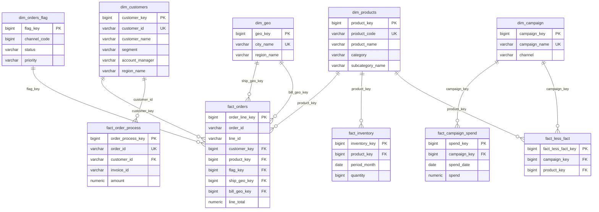

# Data Warehouse Schema Documentation

## 1. Architecture Overview

This warehouse follows a **Kimball-style star schema**, built in the `core` schema on top of raw data landed in `staging`. Every dimension uses **SCD Type 1** (overwrite in place, no history retained) driven by a `source_updated_at` comparison, so re-running a load script is always safe — rows only get touched when something actually changed upstream.

There are two loosely connected "fact families," tied together by dimensions that are **conformed** (shared across more than one fact table):

- **Order fulfillment domain** — `fact_orders`, `fact_order_process`, `fact_inventory`
- **Marketing domain** — `fact_campaign_spend`, `fact_less_fact`

`dim_products` is the conformed dimension that bridges the two domains: it's referenced by `fact_orders`, `fact_inventory`, and `fact_less_fact`. `dim_campaign` bridges `fact_campaign_spend` and `fact_less_fact`. This is what makes it a true star schema rather than a set of disconnected tables — you can answer questions that span both domains (e.g. "was this product being promoted in a campaign when it sold out?") by pivoting through the shared dimension, without the two facts ever joining to each other directly.

### Fact table patterns used

| Fact | Pattern | Grain |
|---|---|---|
| `fact_orders` | Transaction fact, SCD1 upsert | One row per order line |
| `fact_order_process` | **Accumulating snapshot** | One row per order, revisited/updated as it moves through the pipeline |
| `fact_inventory` | Periodic snapshot, SCD1 upsert | One row per product per month |
| `fact_campaign_spend` | Periodic snapshot, SCD1 upsert | One row per campaign per day |
| `fact_less_fact` | **Factless fact** (relationship only, no measures) | One row per campaign–promoted-product pair |

`fact_order_process` is the odd one out: unlike every other fact here, its rows are *mutated in place* rather than only ever inserted or measure-updated — the same `order_id` row gets its `ship_date`, `delivery_date`, `invoice_date`, and `pay_date` filled in progressively as the order moves through ordered → shipped → delivered → invoiced → paid. `OrderID` and `InvoiceID` are carried as **degenerate dimensions** — identifiers with no dimension table of their own, just useful for grouping/filtering directly on the fact.

`dim_orders_flag` is a **junk dimension** — it exists purely to bundle three low-cardinality, unrelated-but-frequently-filtered attributes (`channel`, `status`, `priority`) into one small table instead of leaving them as bare columns on `fact_orders`.

---

## 2. Entity Relationship Diagram

Note `dim_geo` joins to `fact_orders` **twice** (ship-to and bill-to), which is a classic "role-playing dimension" — the same physical table used in two different business roles on the same fact row.

---

## 3. Fact Tables

### `fact_orders`
- **Grain:** one row per order line (`order_id`, `line_id`)
- **Source:** `staging.orders_2025` + `staging.orders_2026` (unioned) joined to `staging.order_line_items`
- **Key measures:** `quantity`, `unit_price`, `unit_cost`, `discount_pct`, `line_total`
- **Dimension keys:** `customer_key`, `product_key`, `flag_key`, `ship_geo_key`, `bill_geo_key`
- **Change detection:** `source_updated_at` = latest of the line item's or order header's `update_at`

### `fact_order_process`
- **Grain:** one row per order (`order_id`)
- **Sources:** orders (header), `staging.shipments`, `staging.invoices`, `staging.payments`
- **Pattern:** accumulating snapshot — milestone dates (`ship_date`, `delivery_date`, `invoice_date`, `pay_date`) and computed lag measures (`days_order_to_ship`, `days_ship_to_delivery`, `days_order_to_invoice`, `days_invoice_to_pay`) are updated on the same row as the order progresses
- **Note:** resolves `customer_id` (the natural key) rather than `customer_key` — see Known Issues below

### `fact_inventory`
- **Grain:** one row per product per month
- **Source:** `staging.inventory`, which arrives wide/pivoted (one column per month: `2025-01` … `2025-12`) and is unpivoted via `CROSS JOIN LATERAL` before loading
- **Measure:** `quantity`
- **Currently covers:** 2025 only — `staging.inventory` has no 2026 monthly columns yet. When they land, the `LATERAL (VALUES ...)` list in the load script needs to be extended to include them.

### `fact_campaign_spend`
- **Grain:** one row per campaign per day
- **Source:** `staging.campaing_logs` (denormalized — one row per campaign per day, attributes repeated), deduped per `(CampaignName, Date)`
- **Measures:** `impressions`, `clicks`, `spend`

### `fact_less_fact`
- **Grain:** one row per (campaign, promoted product) pair
- **Source:** `staging.campaing_sku`
- **No measures** — this table only records that a relationship existed. Answers "which SKUs were promoted in which campaigns," and is the join path that connects the marketing domain to the product dimension shared with the order domain.

---

## 4. Dimension Tables

### `dim_customers`
One row per customer, built by joining `staging.cust_master` (base record) to `staging.customer_contach` (primary contact email), `staging.user_details` (phone, credit limit), `staging.addres` (street), and `staging.cities` (city/region name). Natural key: `customer_id`.

### `dim_products`
One row per product, from `staging.products` joined to `staging.subcategory` for a cleaned-up subcategory/category label (case-normalized via `INITCAP`). Natural key: `product_code`.

### `dim_geo`
One row per city, from `staging.cities`. Carries `region_name` as an attribute rather than a separate region dimension — regions are not modeled as their own conformed dimension in this schema. Natural key: `city_name`.

### `dim_campaign`
One row per campaign, deduped from the denormalized `staging.campaing_logs`. Natural key: `campaign_name`.

### `dim_orders_flag` (junk dimension)
One row per distinct `(channel_code, status, priority)` combination actually observed in the order data — not a full cross-product, just what's seen. Loaded with `INSERT ... ON CONFLICT DO NOTHING` since there's nothing to overwrite (the combination itself is the identity, not a measure).

---

## 5. Known Issues / Open Items

- **`fact_order_process` uses `customer_id` (natural key) as its FK**, while `fact_orders` uses `customer_key` (surrogate key) to reference the same dimension. Both work, but it's inconsistent — recommend standardizing on `customer_key` everywhere for clean conformance.
- **`dim_customers` dedup ranks by the *address* table's `update_at`** (`staging.addres.update_at`), not the customer master's own timestamp, and then filters out any row where that value is null. A customer whose address record has no timestamp will be silently excluded from the load even if their core customer record is valid. Worth revisiting the ranking column or using `COALESCE` across sources.
- **`dim_geo` has no dedicated region dimension** — `region_name` is stored as free text on both `dim_geo` and `dim_customers` rather than as a foreign key to a shared region table. If `staging.region` (id → region name lookup) is meant to formalize this, it isn't wired in yet.
- Several staging tables have no load script at all yet — see `data_catalog.md` for the full list and hypotheses on what they are.

---

## 6. Load Order

Dimensions must load before the facts that reference them:

1. `dim_customers`, `dim_geo`, `dim_products`, `dim_campaign`, `dim_orders_flag`
2. `fact_orders`, `fact_order_process`, `fact_inventory`, `fact_campaign_spend`, `fact_less_fact` (any order, once step 1 is complete — `fact_less_fact` needs both `dim_campaign` and `dim_products`)